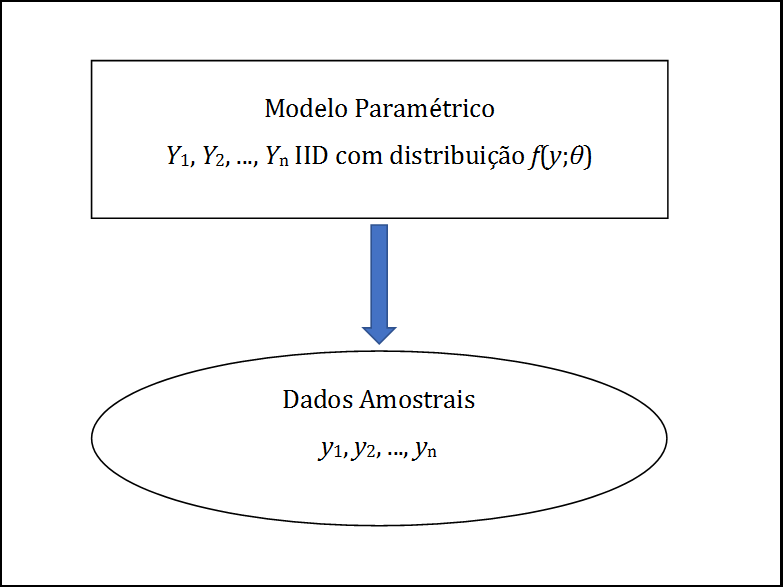
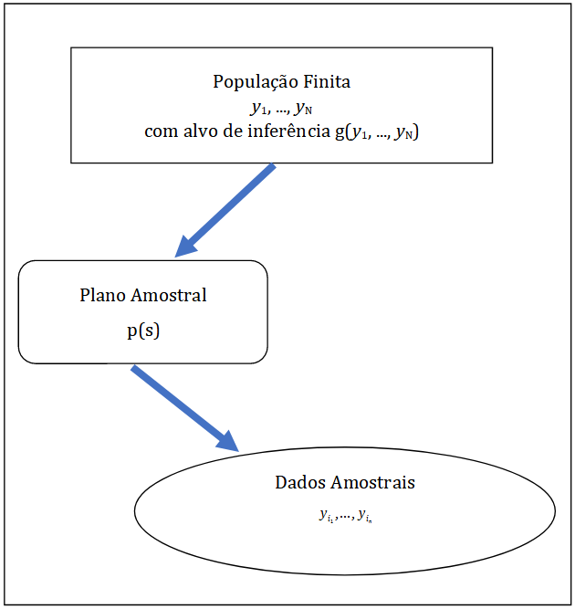
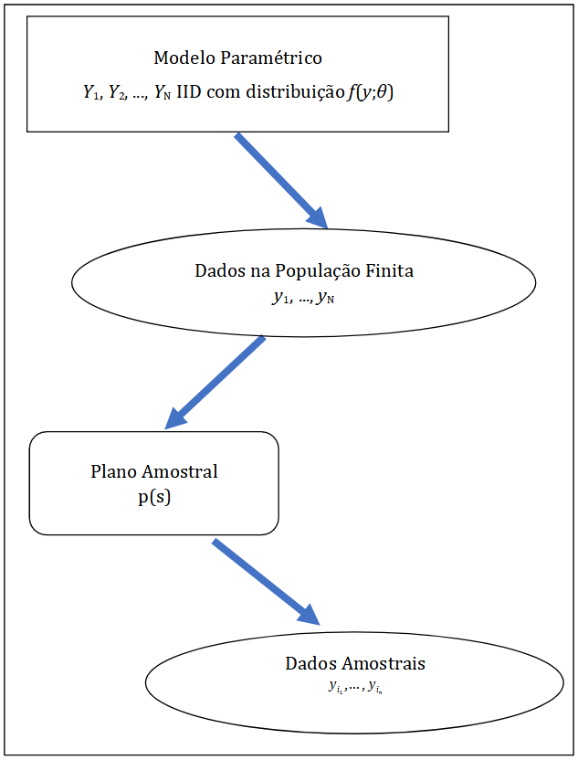

---
output:
  html_document: default
editor_options: 
  markdown: 
    wrap: 80
---
# Referencial para Inferência {#refinf}

## Modelagem - Primeiras ideias 

Com o objetivo de dar uma primeira ideia sobre o assunto a ser tratado neste
livro vamos considerar, em situações simples, algumas abordagens alternativas
para modelagem e análise estatística. A ideia é apresentar a principal abordagem que vamos considerar, a de *Modelagem de Superpopulação*, em contraste com as alternativas que poderiam ser consideradas, mas que tornariam difícil incorporar adequadamente as características que diferenciam dados obtidos com amostras complexas de outros.

## Abordagem 1 - Modelagem Clássica {#classic}

Seja $y$ uma variável de pesquisa (ou de interesse), e sejam $n$ observações desta variável para uma amostra de unidades de pesquisa denotadas por $y_1, \ldots ,y_n$. Em Inferência Estatística, a abordagem que aqui chamamos de *Modelagem Clássica*  considera $y_1, \ldots ,y_n$ como valores (realizações) de variáveis aleatórias $Y_1, \ldots ,Y_n$.

Podemos formular modelos bastante sofisticados para a distribuição conjunta
destas variáveis aleatórias, mas para simplificar a discussão, vamos inicialmente
supor que $Y_1, \ldots ,Y_n$ são variáveis aleatórias independentes e
identicamente distribuídas - IID, com a mesma distribuição caracterizada pela função de densidade ou de frequência $f(y;\theta)$, onde $\theta \in \Theta$ é o parâmetro (um vetor de dimensão $K \times 1$) indexador da distribuição $f$, e $\Theta$ é o espaço paramétrico. A partir das observações $y_1, \ldots ,y_n$, são feitas inferências a respeito do parâmetro $\theta$.

Uma representação gráfica esquemática dessa abordagem é apresentada na Figura
\@ref(fig:modclas), e uma descrição esquemática resumida é apresentada na Tabela
\@ref(tab:modelclass).

```{r,modclas, echo=FALSE, fig.cap="Representação esquemática da *Modelagem Clássica*",fig.align="center"}

```

```{r, echo=FALSE, label=modelclass}
suppressMessages(library(kableExtra))

l1=c('Dados Amostrais (observações) ','$y_1, \\ldots, y_n$')
l2=c('Modelo Paramétrico/ Hipóteses', '$Y_1, \\ldots , Y_n \\text{ variáveis aleatórias IID com distribuição } f(y,\\theta) \\text{ onde } \\theta \\in \\Theta$')
l3=c('Objetivo', '$\\text{Inferir sobre } \\theta 
     \\text{ usando as observações } y_1, \\ldots, y_n$')      

tabela=as.data.frame(t(data.frame(l1,l2,l3)))

names(tabela) <- NULL

knitr::kable(tabela,align= "ll",format.args= list(big.mark = '.',dec=','), escape = F, booktabs=T,
caption= "$\\text{Representação esquemática da abordagem }\\textit{Modelagem Clássica}$",row.names=FALSE)%>% 
kable_styling(full_width = F,latex_options = 'HOLD_position')%>%column_spec(column=1,width='4.5cm')

```

Do ponto de vista matemático, o parâmetro $\theta$ serve para indexar os
elementos da família de distribuições $\left\{f\left( y;\theta \right);\theta \in \Theta \right\}$. Na prática, as questões relevantes da pesquisa são traduzidas em termos de perguntas sobre o valor ou região a que pertence o parâmetro $\theta$, e a inferência sobre $\theta$ a partir dos dados ajuda a responder tais questões.

Esta abordagem é útil em estudos analíticos tais como, por exemplo, na
investigação da natureza da associação entre variáveis (modelos de regressão
linear ou logística, modelos log-lineares, etc.). Vários exemplos discutidos ao
longo dos Capítulos \@ref(modreg), \@ref(testqualajust) e \@ref(testetab2)
ilustram situações deste tipo. No Capítulo \@ref(estimacao-de-densidades) o foco é a estimação não paramétrica da forma da função $f(y;\theta)$.

Inferência sob modelos do tipo descrito nesta seção forma o conteúdo de um curso
introdutório de inferência estatística. Mais detalhes podem ser consultados, por
exemplo, em @Casella2010 e @Marcos2015.

```{example, label="distbin"}
Estimação da proporção de sucessos em ensaios de Bernoulli
```
Para dar um exemplo concreto de modelagem do tipo descrito aqui, considere uma sequência de $n$ ensaios de Bernoulli, em que a cada ensaio a resposta é o indicador de ocorrência de um evento de interesse - por exemplo, o indivíduo amostrado já foi vacinado contra uma doença especificada. 

Se considerarmos que os resultados desses ensaios podem ser modelados como uma sequência de variáveis aleatórias $Y_1, \ldots ,Y_n$ IID, com distribuição de Bernoulli dada por $f(y;\theta)=\theta^y \times (1 - \theta)^{(1-y)}$, com $\theta \in (0;1)$, podemos usar a amostra observada $y_1, \ldots ,y_n$ para fazer inferência sobre $\theta$. 

Sob o modelo especificado, é fácil deduzir que $T = \sum_{i=1}^n Y_i$ tem distribuição Binomial de parâmetros $(n, \theta)$. Logo, $\overline{T} = T/n$ tem média $\theta$. Portanto, considerando o método dos momentos, $\overline{T}$ pode ser usado para estimar o parâmetro de interesse $\theta$. Ademais, como $n$ é conhecido, sabemos que a variância da sua distribuição de probabilidades é dada por $\theta \times (1 - \theta) / n$, podendo ser estimada sem viés usando $\overline{T} \times (1 - \overline{T}) / (n-1)$. 

Para amostras de tamanho grande ($n \rightarrow \infty$), podemos usar o Teorema Central do Limite  - TCL para obter intervalos de confiança de nível especificado para $\theta$ e também testar hipóteses sobre regiões de interesse.


## Abordagem 2 - Amostragem Probabilística

A abordagem adotada pelos praticantes de *Amostragem Probabilística*
(amostristas) considera uma população finita $U=\{1, \ldots ,N\}$, da qual é
selecionada uma amostra $s=\left\{ i_{1}, \ldots ,i_{n}\right\}$, segundo um
plano amostral caracterizado por $p(s)$, probabilidade de ser
selecionada a amostra $s$, suposta calculável para todas as possíveis amostras.
Os valores $y_{1}, \ldots ,y_{N}$ da variável de interesse $y$ na *população finita* são considerados fixos, porém desconhecidos.

A partir dos valores observados na amostra $s$, denotados por $y_{i_1}, \ldots, y_{i_n}$, são feitas inferências a respeito de funções dos valores populacionais, digamos $g\left( y_{1}, \ldots , y_{N}\right)$. Os valores de tais funções são quantidades descritivas populacionais - QDPs, também denominadas *parâmetros da população finita* pelos amostristas. 

Em geral, o objetivo desta abordagem é fazer estudos descritivos utilizando funções $g$ particulares, tais como totais $g\left( y_{1}, \ldots , y_{N}\right) = \sum_{i=1}^{N} y_{i}$ , médias $g\left( y_{1}, \ldots , y_{N}\right) = N^{-1}\sum_{i=1}^{N} y_{i}$, proporções, razões, etc. Uma descrição esquemática resumida dessa abordagem é apresentada na Tabela \@ref(tab:modelamo), e uma representação gráfica resumida na Figura \@ref(fig:modamo).


```{r, echo=FALSE, label=modelamo}
suppressMessages(library(kableExtra))

l1=c('Dados Amostrais','$y_{i_1}, \\ldots, y_{i_n}$')

l2=c('Modelo / Hipóteses','$\\text{Dados extraídos de }y_1,\\ldots, y_N \\text{ segundo }p(s)$')

l3=c('Objetivo','$\\text{Inferir sobre funções }g(y_1, \\ldots , y_N)\\text{ usando }y_{i_1}, \\ldots, y_{i_n}$')       

tabela=as.data.frame(t(data.frame(l1,l2,l3)))

names(tabela) <- NULL

knitr::kable(tabela,align= "ll",format.args= list(big.mark = '.',dec=','), escape = F, booktabs=T,
caption= "$\\text{Representação esquemática da abordagem }\\textit{Amostragem Probabilística}$",row.names=FALSE)%>% 
kable_styling(full_width = F,latex_options = 'HOLD_position')%>%column_spec(column=1,width='4.5cm')

```

```{r,modamo, echo=FALSE, fig.cap="Representação esquemática da *Amostragem Probabilística*",fig.align="center"}

```

Esta abordagem é largamente empregada na produção de estatísticas públicas e
oficiais, por agências e instituições de muitos países. Uma das alegadas vantagens dessa abordagem é o fato de que as distribuições de referência usadas para inferência são controladas pelos amostristas que planejam as pesquisas por
amostragem e, portanto, a inferência pode ser considerada não paramétrica e não
dependente de modelos que precisariam ser especificados pelo analista.

Uma revisão detalhada da amostragem probabilística pode ser encontrada em @Silva2020. Nessa abordagem, a inferência é geralmente guiada também por distribuições dos estimadores aproximadas usando o TCL. 

```{example, label="aestot"}
Estimação do total com amostragem estratificada simples
```

Considere o cenário de uma população $U$ que foi estratificada em $H$ grupos com base numa variável de estratificação $x$. Dos estratos formados, foram selecionadas de forma independente amostras aleatórias simples de tamanhos $n_1, \ldots, n_h, \ldots, n_H$. Nessa população, denotando por $U_h$ o $h$-ésimo estrato, de tamanho $N_h$, o total populacional da variável de pesquisa $y$ pode ser escrito como:

$$
T_y = \sum_{h=1}^H \sum_{i \in U_h} y_i
$$
O estimador padrão (tipo Horvitz-Thompson) para este parâmetro na amostragem estratificada simples é dado por:

$$
\widehat {T_y} = \sum_{h=1}^H \frac{N_h}{n_h} \sum_{i \in s_h} y_i,
$$
onde $s_h$ é a amostra das unidades do estrato $h, h=1, 2,\dots,H$.

Este estimador pode ser usado para fazer inferência sobre o total populacional, como descrito, por exemplo, na seção 11.2 de @Silva2020. A distribuição do estimador $\widehat {T_y}$ obtida considerando o plano amostral $p(s)$ é denominada de *distribuição de aleatorização* e é geralmente aproximada usando o TCL para viabilizar a inferência.


## Discussão das abordagens 1 e 2

A primeira abordagem (*Modelagem Clássica*), nos termos descritos, foi
inicialmente proposta para dados de medidas na Física e Astronomia, onde em
geral o pesquisador tem relativo controle sobre os experimentos, e onde faz
sentido falar em replicação ou repetição do experimento. Neste contexto, a ideia
de aleatoriedade é geralmente introduzida para modelar os erros (não
controláveis) do processo de medição, e as distribuições de estatísticas de
interesse são derivadas a partir da *distribuição do modelo* especificado.

A segunda abordagem (*Amostragem Probabilística*) é utilizada principalmente
no contexto de estudos socioeconômicos observacionais, para levantamento de
dados por agências produtoras de informações estatísticas públicas ou oficiais. Nesta abordagem, a aleatoriedade é introduzida pelo pesquisador no processo conduzido para obtenção dos dados, através do *plano amostral* $p(s)$ utilizado para selecionar as unidades de uma população finita $U$ para observação ou medição, e as distribuições das estatísticas de interesse são derivadas a
partir dessa *distribuição de aleatorização*.

Os planos amostrais podem ser complexos, gerando observações afetadas pelas
características i) a iv) mencionadas no Capítulo \@ref(introduc). Os dados
obtidos são utilizados principalmente para descrição da população finita,
mediante o cálculo de estimativas de *parâmetros descritivos* usuais tais como
totais, médias, proporções, razões, etc. 

Sob a abordagem de *Amostragem Probabilística*, os pontos i) a iv) do Capítulo \@ref(introduc) são devidamente considerados tanto na estimação dos parâmetros descritivos como, também, na estimação de variâncias dos estimadores, permitindo a inferência pontual e por intervalos de confiança baseada na distribuição assintótica normal dos estimadores habitualmente considerados.

A abordagem de *Amostragem Probabilística* é essencialmente não paramétrica,
pois não supõe uma distribuição paramétrica particular para as observações da
amostra. Por outro lado, essa abordagem tem a desvantagem de fazer inferências
restritas à particular população finita considerada.

Apesar da abordagem de *Amostragem Probabilística* ter sido inicialmente
concebida e aplicada para problemas de inferência descritiva sobre populações
finitas, é cada vez mais comum, porém, a utilização dos dados obtidos através de
pesquisas amostrais complexas para fins analíticos, com a aplicação de métodos
de análise desenvolvidos e apropriados para a abordagem de *Modelagem Clássica*.
Nesse contexto, é relevante considerar algumas questões de interesse:

-   É adequado aplicar métodos de análise da *Modelagem Clássica*, concebidos para observações de variáveis aleatórias IID, aos dados obtidos através de pesquisas amostrais complexas?

-   Em caso negativo, seria possível corrigir estes métodos, tornando-os aplicáveis para tratar dados amostrais complexos?

-   Ou seria mais adequado fazer uso analítico dos dados dentro da abordagem de *Amostragem Probabilística*? E neste caso, como fazer isto, visto que nesta     abordagem não é especificado um modelo para a distribuição das variáveis de     pesquisa *na população*?

Além destas questões, também é de interesse a questão da *robustez da inferência*,
traduzida nas seguintes perguntas:

-   O que acontece quando o modelo adotado na *Modelagem Clássica* não é verdadeiro?

-   Neste caso, qual a interpretação dos parâmetros na *Modelagem Clássica*?

-   Ainda neste caso, as quantidades descritivas populacionais da *Amostragem     Probabilística* poderiam ter alguma utilidade ou interpretação?

O objeto deste livro é exatamente discutir respostas para as questões aqui
enumeradas. Para isso, vamos considerar uma abordagem que propõe um modelo
parametrizado como na *Modelagem Clássica*, mas formulado para descrever os
dados da *população*, e não os da amostra. Essa abordagem incorpora na análise os pontos i) a iii) do Capítulo \@ref(introduc) mediante aproveitamento da estrutura do plano amostral, como feito habitualmente na *Amostragem Probabilística*. Essa abordagem, denominada de *Modelagem de Superpopulação*, foi primeiro proposta em @Brewer1963 e @royall1970, e é bem descrita, por exemplo, em @binder83 e @valliant2000.


## Abordagem 3 - Modelagem de Superpopulação {#modelsuperpop}

Nesta abordagem, os valores $y_{1}, \ldots , y_{N}$ da variável de interesse
$y$ na população finita são considerados observações ou realizações das variáveis
aleatórias $Y_{1}, \ldots , Y_{N}$, supostas IID com distribuição $f(y;\theta)$,
onde $\theta \in \Theta$. Este modelo é denominado *Modelo de Superpopulação*. Note que, em contraste com o que se faz na *Modelagem Clássica*, o modelo probabilístico é aqui especificado para descrever o mecanismo aleatório que gera
a *população*, não a amostra. 

Na maioria das aplicações práticas, a população de interesse, embora considerada finita, jamais será observada por inteiro. Não obstante, ao formular o modelo para descrever propriedades da população, nossas perguntas e respostas descritas em termos de valores ou regiões para o parâmetro $\theta$ passam a se referir à população de interesse ou a populações similares, quer existam ao mesmo tempo, quer se refiram a estados futuros (ou passados) da mesma população. Vale realçar também que pesquisas por amostragem "consistem em selecionar parte de uma população para observar, de modo que seja possível estimar alguma coisa sobre toda a população", conforme @thompson1992.

Utilizando um plano amostral definido por $p(s)$, obtemos os valores das
variáveis de pesquisa na amostra $y_{i_1}, \ldots , y_{i_n}$. A partir de
$y_{i_1}, \ldots , y_{i_n}$, em geral não considerados como observações de
vetores aleatórios IID, queremos fazer inferência sobre o parâmetro $\theta$,
considerando os pontos i) a iii) do Capítulo \@ref(introduc). Ver uma representação gráfica
resumida desta abordagem na Figura \@ref(fig:modsup).

```{r, modsup, echo=FALSE, fig.cap="Representação esquemática da *Modelagem de Superpopulação*",fig.align="center"}

```

Adotando o *Modelo de Superpopulação* e considerando métodos usuais disponíveis
na *Modelagem Clássica*, podemos utilizar funções de $y_{1}, \ldots ,y_{N}$ ,
digamos $g( y_{1}, \ldots , y_{N})$, para fazer inferência sobre $\theta$. Desta
forma, definimos estatísticas $g\left( y_{1}, \ldots , y_{N} \right)$ (no sentido da *Modelagem Clássica*) que são quantidades descritivas populacionais (parâmetros
populacionais no contexto da *Amostragem Probabilística*), que passam a ser os
novos parâmetros-alvo. 

O passo seguinte é utilizar métodos disponíveis na *Amostragem Probabilística* para fazer inferência sobre $g\left( y_{1}, \ldots , y_{N} \right)$ com base nas observações (dados amostrais) $y_{i_1}, \ldots , y_{i_n}$. Note que não é possível basear a inferência nos valores populacionais $y_{1}, \ldots , y_{N}$, já que estes não são conhecidos ou observados. Este último passo adiciona a informação sobre o plano amostral utilizado, contida em $p(s)$, à informação estrutural contida no modelo $\left\{ f\left( y; \theta \right) ; \theta \in \Theta \right\}$. 

Uma representação esquemática dessa abordagem é apresentada na Tabela
\@ref(tab:modelsuperpop).

```{r, echo=FALSE, label=modelsuperpop}
suppressMessages(library(kableExtra))

l1=c('Dados Amostrais','$y_{i_1}, \\ldots, y_{i_n}$')
l2=c('População e esquema de seleção','$\\text{Selecionados de } y_1, \\dots, y_N \\text{ segundo } p(s)$')
l3=c('Modelo para população','$Y_1, \\dots, Y_N \\text{ variáveis aleatórias IID com distribuição } f(y, \\theta),\\text { onde } \\theta \\in \\Theta$')
l4=c('Parâmetro-alvo','$\\text{Associar } \\theta\\Leftrightarrow g\\left (Y_{1},\\ldots,Y_{N}\\right)$')
l5=c('Objetivo','$\\text{Inferir sobre }g\\left( y_{1}, \\ldots , y_{N} \\right) \\text{ partir de } y_{i_1}, \\ldots, y_{i_n} \\text{ usando } p(s)$ ')

tabela=as.data.frame(t(data.frame(l1,l2,l3,l4,l5)))

names(tabela) <- NULL

knitr::kable(tabela,align= "ll",format.args= list(big.mark = '.',dec=','),escape = F, booktabs=T,
caption= "$\\text{Representação esquemática da } \\textit{Modelagem de Superpopulação}$", row.names=FALSE)%>% 
kable_styling(full_width = F,latex_options = 'HOLD_position')%>%column_spec(column=1,width='5cm')

```

A descrição da abordagem adotada neste livro foi apresentada de maneira
propositalmente simplificada e vaga nesta seção, mas é aprofundada ao longo
do texto. Admitimos que o leitor esteja familiarizado com a *Modelagem Clássica* e com as noções básicas da *Amostragem Probabilística*. 

A título de recordação, são apresentados na Seção \@ref(planamo) alguns resultados básicos da *Amostragem Probabilística*. A ênfase do texto, porém, é a apresentação da *Modelagem de Superpopulação*, sendo para isto apresentados os elementos indispensáveis das abordagens de *Modelagem Clássica* e da *Amostragem Probabilística*.

Ao construir e ajustar modelos a partir de dados de pesquisas amostrais
*complexas*, tais como as executadas pelo IBGE e outras instituições similares,
o usuário precisará incorporar as informações sobre pesos e sobre a estrutura dos
planos amostrais utilizados para obtenção dos dados. Em geral, ao publicar os resultados das pesquisas, os pesos são considerados, sendo possível produzir estimativas pontuais *corretas* utilizando os pacotes computacionais tradicionais. Por outro lado, para construir intervalos de confiança e testar hipóteses sobre parâmetros de modelos, é necessário conhecer estimativas de variâncias e covariâncias das
estimativas, obtidas levando em conta a estrutura do plano amostral utilizado.

Mesmo conhecendo o plano amostral, geralmente não é simples incorporar pesos e
plano amostral na análise sem o uso de pacotes especializados, ou de rotinas
específicas já agora disponíveis em alguns dos pacotes mais comumente utilizados
(por exemplo, SAS, STATA, SPSS, ou R entre outros). Tais pacotes especializados
ou rotinas específicas utilizam, em geral, métodos aproximados para estimar
matrizes de covariância. Entre esses métodos, destacam-se o de Máxima
Pseudo-Verossimilhança, a Linearização de Taylor, o método do Conglomerado Primário e métodos de reamostragem, que serão descritos mais adiante.

Em outras palavras, o uso dos pacotes usuais para analisar dados produzidos por
pesquisas com planos amostrais complexos, tal como o uso de muitos remédios,
pode ter contraindicações. Cabe ao usuário *ler a bula* e identificar situações
em que o uso de tais pacotes pode ser inadequado e buscar opções de rotinas
específicas ou de pacotes especializados capazes de incorporar adequadamente a
estrutura do plano amostral nas análises.

Ao longo deste livro fazemos uso intensivo do pacote *survey* e outros disponíveis no R, mas o leitor pode encontrar funcionalidade semelhante em alguns outros sistemas.
Nossa escolha se deveu a dois fatores principais: primeiro ao fato do sistema R
ser aberto, livre e gratuito, dispensando o usuário de custos de licenciamento,
bem como possibilitando aos interessados o acesso ao código fonte e à capacidade
de modificar as rotinas de análise, caso necessário. O segundo fator é de
natureza mais técnica, porém transitória. No presente momento, o pacote *survey*
do R é a coleção de rotinas mais completa e genérica existente para análise de dados amostrais complexos, dispondo de funções capazes de ajustar os modelos usuais, mas também de ajustar modelos não convencionais, mediante a maximização numérica de verossimilhanças especificadas pelo usuário. 

Sabemos, entretanto, que muitos usuários habituados à facilidade de uso de pacotes com interfaces gráficas do tipo *aponte e clique* terão dificuldade adicional de adaptar-se à linguagem de comandos utilizada pelo sistema R, mas acreditamos que os benefícios do aprendizado desta nova ferramenta compensarão largamente os custos adicionais do aprendizado.

O emprego de ferramentas de análise como o pacote *survey* permite aos
usuários focar sua atenção mais na seleção, análise e interpretação dos modelos
ajustados do que nas dificuldades técnicas envolvidas nos cálculos
correspondentes. É com este espírito que escrevemos este texto, que busca
apresentar os métodos, ilustrando seu uso com exemplos reais e orientando sobre o uso adequado das ferramentas de modelagem e análise disponíveis no sistema R.

## Fontes de variação

Esta seção estabelece o referencial para inferência em pesquisas amostrais que
será usado no restante deste texto. @cassel1977 sugerem que um referencial para
inferência poderia considerar três fontes de aleatoriedade (incerteza,
variação), incluindo:

1.  *Modelo de Superpopulação*, que descreve o processo subjacente que, por
    hipótese, gera as medidas verdadeiras para todas as unidades da população
    considerada;

2.  *Processo de Medição*, que diz respeito aos instrumentos e métodos usados
    para obter as medidas de qualquer unidade da população;

3.  *Plano Amostral*, que estabelece o mecanismo pelo qual unidades da
    população são selecionadas para participar da amostra da pesquisa ou estudo.

Uma quarta fonte de incerteza que precisa ser acrescentada às anteriores é o

4.  *Mecanismo de resposta*, ou seja, o mecanismo que controla se valores de
    medições de unidades selecionadas para a amostra são obtidos / observados ou
    não.

Para concentrar o foco nas questões de maior interesse deste texto, as fontes
(2) e (4) não serão consideradas no referencial adotado para a maior parte dos
capítulos. Para o tratamento das dificuldades causadas por não resposta, a fonte
(4) será considerada no Capítulo xx. 

Assim sendo, exceto onde explicitamente indicado, de agora em diante admitiremos que não há *erros de medição*, implicando que os valores observados de quaisquer variáveis de interesse são considerados valores corretos ou verdadeiros. Admitimos ainda que há *resposta completa*, implicando que os valores de quaisquer variáveis de interesse estão disponíveis para todos os elementos da amostra selecionada depois que a pesquisa foi realizada. Hipóteses semelhantes são adotadas, por exemplo, em @binder83 e @Mont87.

Portanto, o referencial aqui adotado considera apenas duas fontes de variação: o *Modelo de Superpopulação* (1) e o *Plano Amostral* (3). Estas fontes de variação, descritas nesta seção apenas de forma esquemática, são discutidas com maiores detalhes a seguir.

A fonte de variação (1) é considerada porque usos analíticos das pesquisas
são amplamente discutidos neste texto, os quais só têm sentido quando é
especificado um modelo estocástico para o processo subjacente que gera as
medidas na população. A fonte de variação (3) é considerada porque a atenção
é focalizada na análise de dados obtidos através de pesquisas amostrais
complexas. Aqui a discussão se restringe a planos amostrais aleatorizados ou
de *Amostragem Probabilística*, não sendo considerados métodos intencionais ou
outros métodos não aleatórios algumas vezes usados para seleção de amostras.

## Modelos de Superpopulação

Seja $\{1, ..., N\}$ um conjunto de rótulos que identificam univocamente os $N$
elementos distintos de uma população-alvo finita $U$. Sem perda de generalidade
tomemos $U=\{1,...,N\}$. Uma pesquisa cobrindo $n$ elementos distintos numa
amostra $s$, $s=\{i_{1},...,i_{n}\} \subset U$, é realizada para medir os valores
de $P$ variáveis de interesse da pesquisa, doravante denominadas simplesmente
*variáveis da pesquisa*.

Denotemos por $\mathbf{y}_i=(y_{i1},...,y_{iP})^{\prime }$ um vetor $P \times 1$
de valores das variáveis da pesquisa e por $\mathbf{x}_{i} = (x_{i1}, \ldots, x_{iQ})^{\prime }$ um vetor $Q\times 1$ de variáveis auxiliares da $i$-ésima unidade da população, respectivamente, para $i=1,...,N$. Aqui as variáveis auxiliares são consideradas como variáveis contendo a informação requerida para o plano amostral e a estimação a partir da amostra, como se discutirá com mais detalhes adiante. 

Denotemos por $\mathbf{y}_{U}$ a matriz $N \times P$ formada empilhando os vetores transpostos das observações das variáveis de pesquisa correspondentes a todas as unidades da população, e por $\mathbf{Y}_{U}$ a correspondente matriz de vetores aleatórios geradores das observações na população.

Quando se supõe que $\mathbf{y}_1 , \ldots, \mathbf{y}_N$ são a realização
conjunta de vetores aleatórios $\mathbf{Y}_1, \ldots, \mathbf{Y}_N$, a
distribuição conjunta de probabilidade de $\mathbf{Y}_1, \ldots, \mathbf{Y}_N$ é
um *Modelo de Superpopulação* (marginal), que doravante denotaremos simplesmente
por $f(\mathbf{y}_U;\theta)$, ou de forma abreviada, por $M$. Esperanças e
variâncias definidas com respeito à distribuição do modelo $M$ serão denotadas
$E_M$ e $V_M$ respectivamente.

Analogamente, $\mathbf{x}_1, \ldots, \mathbf{x}_N$ pode ser considerada uma
realização conjunta de vetores aleatórios $\mathbf{X}_1, \ldots, \mathbf{X}_N$.
As matrizes $N \times Q$ formadas empilhando os vetores transpostos das
observações das variáveis auxiliares correspondentes a todas as unidades da
população, $\mathbf{x}_{U}$, e a correspondente matriz $\mathbf{X}_{U}$ de
vetores aleatórios geradores das variáveis auxiliares na população são definidas
de forma análoga às matrizes $\mathbf{y}_{U}$ e $\mathbf{Y}_{U}$.

O referencial aqui adotado permite a especificação da distribuição conjunta
combinada das variáveis da pesquisa e das variáveis auxiliares. Representamos
por $f( \mathbf{y}_U , \mathbf{x}_U ; \mathbf{\eta} )$ a função de densidade de
probabilidade conjunta de $( \mathbf{Y}_U , \mathbf{X}_U )$, onde $\mathbf{\eta}$ é um vetor de parâmetros.

Um tipo importante de modelo de superpopulação é obtido quando os vetores
aleatórios correspondentes às observações de unidades diferentes da população
são supostos independentes e identicamente distribuídos - IID. Neste caso, o
modelo de superpopulação pode ser escrito como:

\begin{eqnarray}
f \left( \mathbf{y}_U , \mathbf{x}_U ; \mathbf{\eta} \right) 
&=&\prod_{i\in U} f\left(\mathbf{y}_i , \mathbf{x}_i ; \mathbf{\eta} \right) (\#eq:ref1) \\
&=&\prod_{i\in U} f\left( \mathbf{y}_i \mathbf{|x}_i ; \mathbf{\lambda} \right) 
f\left( \mathbf{x}_i ; \mathbf{\phi} \right) (\#eq:ref2)
\end{eqnarray} onde $\mathbf{\lambda}$ e $\mathbf{\phi}$ são vetores de
parâmetros.

Sob \@ref(eq:ref2), o modelo marginal correspondente das variáveis da pesquisa
seria obtido integrando nas variáveis auxiliares:

\begin{equation}
f(\mathbf{y}_U ; \mathbf{\theta}) = f(\mathbf{y}_1 ,\ldots ,\mathbf{y}_N ; \mathbf{\theta}) = \prod_{i\in U} \int f\left( \mathbf{y}_i \mathbf{|x}_i ; \mathbf{\lambda} \right) f\left( \mathbf{x}_i ; \mathbf{\phi} \right) \mathbf{dx}_i = \prod_{i\in U} f\left( \mathbf{y}_i ; \mathbf{\theta} \right) (\#eq:ref3)
\end{equation} 

onde $f\left( \mathbf{y}_i ; \mathbf{\theta} \right) = \int f\left( \mathbf{y}_i | \mathbf{x}_i ; \mathbf{\lambda} \right) f\left( \mathbf{x}_i ; \mathbf{\phi} \right) \mathbf{dx}_i$ e $\mathbf{\theta =} h\left( \mathbf{\lambda} , \mathbf{\phi} \right)$ é função de $\mathbf{\lambda}$ e $\mathbf{\phi}$.

Outro tipo especial de modelo de superpopulação é o modelo de população fixa,
que supõe que os valores numa população finita são fixos mas desconhecidos. Este
modelo pode ser descrito por:

\begin{equation}
P\left[ \left( \mathbf{Y}_U , \mathbf{X}_U \right) = \left( \mathbf{y}_U , \mathbf{x}_U \right) \right] = 1 (\#eq:ref4)
\end{equation} 

ou seja, uma distribuição degenerada é especificada para
$\left(\mathbf{Y}_U , \mathbf{X}_U \right)$.

Este modelo foi considerado em @cassel1977, que o chamaram de *abordagem de população fixa*, e afirmaram ser esta a abordagem subjacente ao desenvolvimento
da teoria da *Amostragem Probabilística* encontrada nos livros clássicos tais como @Cochran1977 e outros. 

Aqui esta abordagem é chamada de *abordagem baseada no plano amostral* ou *abordagem de aleatorização*, pois neste caso a única fonte de variação (aleatoriedade) é proveniente do plano amostral. Em geral, a distribuição conjunta de $\left( \mathbf{Y}_U , \mathbf{X}_U \right)$ não precisa ser degenerada como especificada em \@ref(eq:ref4), embora o referencial aqui adotado seja suficientemente geral para permitir considerar esta possibilidade.

Se todas as unidades da população $U$ fossem pesquisadas (ou seja, se fosse
executado um *censo*), os dados observados seriam $(\mathbf{y}_1 , \mathbf{x}_1), \ldots, (\mathbf{y}_N , \mathbf{x}_N)$. Sob a hipótese de resposta completa, a única fonte de incerteza seria devida ao fato de que $(\mathbf{y}_1 , \mathbf{x}_1), \ldots, (\mathbf{y}_N , \mathbf{x}_N)$ é uma realização de
$\left( \mathbf{Y}_1, \mathbf{X}_1 \right), \ldots, \left( \mathbf{Y}_N, \mathbf{X}_N \right)$. Os dados observados poderiam então ser usados para fazer inferências sobre $\mathbf{\eta}, \mathbf{\phi},\mathbf{\lambda}$ ou $\mathbf{\theta}$ usando procedimentos padrões.

Inferência sobre quaisquer dos parâmetros $\mathbf{\eta}, \mathbf{\phi}, \mathbf{\lambda}$ ou $\mathbf{\theta}$ do modelo de superpopulação é chamada *inferência analítica*. Este tipo de inferência só faz sentido quando o modelo de superpopulação não é degenerado como em \@ref(eq:ref4). Usualmente seu objetivo é explicar a relação entre variáveis não apenas para a população finita sob análise, mas também para outras populações que poderiam ter sido geradas pelo modelo de superpopulação adotado. Vários exemplos de inferência analítica serão discutidos ao longo deste livro.

Se o objetivo da inferência é estimar quantidades que fazem sentido somente para
a população finita sob análise, tais como funções $g\left( \mathbf{y}_1, \ldots, \mathbf{y}_N \right)$ dos valores das variáveis da pesquisa, o modelo de superpopulação não é estritamente necessário, embora possa ser útil. Inferência para tais quantidades, chamadas parâmetros da população finita ou quantidades descritivas populacionais - QDPs, é chamada *inferência descritiva*.

Vale notar que a especificação do modelo de superpopulação aqui proposta serve
tanto para o caso da abordagem clássica para inferência, como também para o caso
da abordagem Bayesiana. Neste caso, a especificação do modelo $M$ precisaria ser
completada mediante a especificação de distribuições *a priori* para os parâmetros
do modelo.

## Plano amostral {#planamo}

Embora *censos* sejam algumas vezes realizados para coletar dados sobre certas
populações, a vasta maioria das pesquisas realizadas é de pesquisas amostrais,
nas quais apenas uma amostra de elementos da população (usualmente uma pequena
parte) é investigada. Neste caso, os dados disponíveis incluem:

1.  O conjunto de rótulos $s=\left\{ i_1 , \ldots, i_n \right\}$ dos distintos
    elementos na amostra, onde $n$, $1 \leq n \leq N$, é o número
    de elementos na amostra $s$, também chamado de *tamanho da amostra*.

2.  Os valores na amostra das variáveis da pesquisa
    $\mathbf{y}_{i_1}, \ldots, \mathbf{y}_{i_n}$.

3.  Os valores das variáveis auxiliares na população
    $\mathbf{x}_1, \ldots, \mathbf{x}_N$, quando a informação auxiliar é dita
    *completa*; alternativamente, os valores das variáveis auxiliares na amostra
    $\mathbf{x}_{i_1}, \ldots, \mathbf{x}_{i_n}$, mais os totais ou médias
    destas variáveis na população, quando a informação auxiliar é dita
    *parcial*.

O mecanismo usado para selecionar a amostra $s$ da população finita $U$ é
chamado *plano amostral*. Uma forma de caracterizá-lo é através da função
$p\left( .\right)$, onde $p(s)$ dá a probabilidade de selecionar a amostra $s$
no conjunto $S$ de todas as amostras possíveis. Só mecanismos amostrais
envolvendo alguma forma de seleção probabilística bem definida serão aqui
considerados. Portanto, supõe-se que $0 \leq p(s) \leq 1 \; \forall \,s \in S$ e
$\sum_{s \in S} p(s) = 1$.

Esta caracterização do plano amostral $p(s)$ é bem geral, permitindo que o
mecanismo de seleção amostral dependa dos valores das variáveis auxiliares
$\mathbf{x}_1, \ldots, \mathbf{x}_N$ bem como dos valores das variáveis da
pesquisa na população $\mathbf{y}_1, \ldots, \mathbf{y}_N$ (*amostragem informativa*, ver Seção \@ref(inform)). Uma notação mais explícita para indicar
esta possibilidade envolveria escrever $p(s)$ como $p\left[ a | (\mathbf{y}_U , \mathbf{x}_U ) \right]$. Tal notação será evitada por razões de simplicidade.

Denotamos por $I(B)$ a função indicadora que assume o valor $1$ quando o evento
$B$ ocorre e $0$ caso contrário. Seja $\mathbf{\Delta}_s = \left[ I(1 \in s), \ldots, I(N \in s) \right]^{\prime}$ um vetor aleatório de indicadores dos elementos incluídos na amostra $s$. Então o plano amostral pode ser alternativamente caracterizado pela distribuição de probabilidade de $\mathbf{\Delta }_s$ denotada por $f\left[ \mathbf{\delta }_s | \left(\mathbf{y}_U, \mathbf{x}_U \right) \right]$, onde $\mathbf{\delta }_s$ é qualquer realização particular de $\mathbf{\Delta }_s$ tal que ${\mathbf{\delta}_s}^{\prime} \mathbf{1}_N = n$, e $\mathbf{1}_N$ é o vetor unitário de dimensão $N$.

Notação adicional necessária nas seções posteriores será agora introduzida.
Denotamos por $\pi_i$ a probabilidade de inclusão da unidade $i$ na amostra $s$,
isto é,

\begin{equation}
\pi_i = P\left( i \in s \right) = \sum_{s \ni i} p(s)  (\#eq:ref5)
\end{equation} 

e denotamos por $\pi_{ij}$ a probabilidade de inclusão conjunta na amostra $s$ das unidades $i$ e $j$, dada por

\begin{equation}
\pi_{ij} = P \left( i \in s , j \in s \right) = \sum_{s \ni i,j} p(s) (\#eq:ref6)
\end{equation} 

para todo $i \neq j \in U$. Note que $\pi_{ii} = \pi_{i}$ $\forall\, i \in U.$

Uma hipótese básica assumida com relação aos planos amostrais aqui considerados
é que $\pi_i > 0$ e $\pi_{ij} > 0$ $\forall\, i,j \in U.$ A hipótese de $\pi_{ij}$
ser positiva é adotada para simplificar a apresentação de expressões para
estimadores de variância dos estimadores dos parâmetros de interesse. Contudo,
esta não é uma hipótese crucial, pois há planos amostrais que não a satisfazem e
para os quais estão disponíveis aproximações e estimadores satisfatórios das
variâncias dos estimadores de totais e de médias.

## Planos amostrais informativos e ignoráveis {#inform}

Ao fazer inferência usando dados de pesquisas amostrais precisamos distinguir
duas situações que requerem tratamentos diferentes. Uma dessas situações ocorre quando o plano amostral empregado para coletar os dados é *informativo*, isto é,
quando o mecanismo de seleção das unidades amostrais pode depender dos valores
das variáveis de pesquisa. 

Um exemplo típico desta situação é o dos *estudos de caso-controle*, em que a amostra é selecionada de tal forma que há *casos* (unidades com determinada condição) e *controles* (unidades sem essa condição), sendo de interesse a modelagem do indicador de presença ou ausência da condição em função de variáveis preditoras, sendo esse indicador uma das variáveis de pesquisa, que é considerada no mecanismo de seleção da amostra. Os métodos que discutimos ao longo deste livro não são adequados, em geral, para esse tipo de situação e, portanto, uma hipótese fundamental adotada ao longo deste texto é que os planos amostrais considerados são *não informativos*, isto é, não podem depender diretamente dos valores das variáveis da pesquisa. Logo eles satisfazem:


\begin{equation}
f\left[ \mathbf{\delta }_s | \left( \mathbf{y}_U , \mathbf{x}_U \right)
\right] = f\left( \mathbf{\delta }_s | \mathbf{x}_U \right) (\#eq:ref7)
\end{equation}

Entre os planos amostrais *não informativos*, precisamos ainda distinguir duas
outras situações de interesse. Quando o plano amostral é Amostragem Aleatória
Simples Com Reposição - AASC, o modelo adotado para a amostra é o mesmo que o
modelo adotado para a população antes da amostragem. Quando isto ocorre, o plano
amostral é dito *ignorável*, porque a inferência baseada na amostra utilizando a
abordagem de *Modelagem Clássica* descrita na Seção \@ref(classic) pode prosseguir sem
problemas. Entretanto, esquemas amostrais desse tipo são raramente empregados na
prática, por razões de eficiência e custo. Em vez disso, são geralmente
empregados planos amostrais envolvendo estratificação, conglomeração e
probabilidades desiguais de seleção (*amostragem complexa*).

Com amostragem complexa, porém, os modelos para a população e a amostra podem
ser muito diferentes (plano amostral *não ignorável*), mesmo que o mecanismo de
seleção não dependa das variáveis de pesquisa, mas somente das variáveis
auxiliares. Neste caso, ignorar o plano amostral pode viciar a inferência. Ver
o Exemplo \@ref(exm:nonigno) adiante.

A definição precisa de ignorabilidade e as condições sob as quais um plano
amostral é *ignorável* para inferência são bastante discutidas na literatura -
ver por exemplo @Sugden84 ou os Capítulos 1 e 2 de @CHSK2003. Porém testar
a ignorabilidade do plano amostral é muitas vezes complicado. Em caso de
dificuldade, o uso dos *pesos amostrais* tem papel fundamental, como se verá
mais adiante.

Uma forma simples de lidar com os efeitos do plano amostral na estimação pontual
de quantidades descritivas populacionais de interesse é incorporar pesos
adequados na análise, como pode ser visto em @Silva e no Capítulo \@ref(capplanamo). Essa forma porém, não resolve por si só o problema de estimação da precisão das estimativas pontuais, nem mesmo o caso da estimação pontual de parâmetros em *modelos de superpopulação*, o que vai requerer métodos específicos discutidos no Capítulo \@ref(ajmodpar).

Como incluir os pesos para proteger contra planos amostrais *não ignoráveis* e a
possibilidade de má especificação do modelo? Uma ideia é modificar os estimadores dos parâmetros de modo que sejam consistentes (em termos da *distribuição de aleatorização*) para quantidades descritivas da população finita da qual a amostra foi extraída, que por sua vez seriam boas aproximações para os parâmetros dos modelos de interesse. Afirmações probabilísticas são então feitas com respeito à *distribuição de aleatorização* $p$ das estatísticas amostrais ou com respeito à distribuição mista ou combinada $Mp$.

A seguir apresentamos um exemplo com a finalidade de ilustrar uma situação de
plano amostral *não ignorável*.

```{example, label="nonigno"}
Efeito da amostragem estratificada simples com alocação desproporcional
```

Considere $N$ observações de uma população finita $U$ onde são consideradas de
interesse duas variáveis binárias $(x_i ; y_i )$. Suponha que na população os
vetores aleatórios $(X_i ; Y_i )$ são independentes e identicamente distribuídos
com distribuição de probabilidades conjunta dada por:


```{r, echo=FALSE, label=Tab24}
suppressMessages(library(kableExtra))

l1=c('$x \\downarrow \\text{ | } y \\rightarrow$','0','1', 'Total')
l2=c('0','$\\eta_{00}$','$\\eta_{01}$','$\\eta_{0+}$')
l3=c('1','$\\eta_{10}$','$\\eta_{11}$','$\\eta_{1+}$')
l4=c('Total','$\\eta_{+0}$','$\\eta_{+1}$','1')

tabela=as.data.frame(t(data.frame(l1,l2,l3,l4)))

names(tabela) <-NULL

knitr::kable(tabela,align= "cccc",format.args= list(big.mark = '.',dec=','),escape = F, booktabs=T,
caption= "$\\text{Distribuição de probabilidades conjunta na população }P( Y_i = y ; X_i = x )$", row.names=FALSE)%>% 
kable_styling(full_width = F,latex_options = 'HOLD_position')%>%column_spec(column=1,width='4cm')%>%
column_spec(column=2,width='2cm')%>%column_spec(column=3,width='2cm')%>%column_spec(column=4,width='2cm')
```

que também pode ser representada por:

\begin{eqnarray}
 f_U (x ; y) &=& P( X = x ; Y = y )\\
             & =& \eta_{00}^{(1-x)(1-y)} \times \eta_{01}^{(1-x)y} \times \eta_{10}^{x(1-y)} \times (1 - \eta_{00} - \eta_{01} - \eta_{10})^{xy} \nonumber
\end{eqnarray} 

onde a designação $f_U$ é utilizada para denotar a distribuição *na população*.

Note agora que a distribuição marginal da variável $Y$ *na população* é
Bernoulli com parâmetro $1 - \eta_{00} - \eta_{10}$, ou alternativamente:

\begin{equation}
 f_U (y) = P( Y = y ) = (\eta_{00} + \eta_{10})^{(1-y)} \times (1 - \eta_{00} - \eta_{10})^y
\end{equation}

De forma análoga, a distribuição marginal da variável $X$ *na população* também
é Bernoulli, mas com parâmetro $1 - \eta_{00} - \eta_{01}$, ou alternativamente:

\begin{equation}
 f_U (x) = P( X = x ) = (\eta_{00} + \eta_{01})^{(1-x)} \times (1 - \eta_{00} - \eta_{01})^x
\end{equation}

Seja $N_{xy}$ o número de unidades na população com a combinação de valores
observados $(x;y)$, onde $x$ e $y$ tomam valores em $\Omega = \{ 0 ; 1 \}$. É
fácil notar então que o vetor de contagens populacionais $\mathbf{N} = ( N_{00}, N_{01}, N_{10}, N_{11} )^{\prime}$ tem distribuição Multinomial com parâmetros $N$ e $\mathbf{\eta} = (\eta_{00} , \eta_{01} , \eta_{10} , 1 - \eta_{00} - \eta_{01} - \eta_{10} )^{\prime}$.

Após observada uma realização do modelo que dê origem a uma população, como
seria o caso da realização de um *censo* na população, a proporção de valores de
$y$ iguais a $1$ observada no censo seria dada por $N_{+1} / N = 1 - (N_{00} - N_{10})/N$. E a proporção de valores de $x$ iguais a $1$ na população seria igual a $N_{1+} / N = 1 - (N_{00} - N_{01})/N$.

Agora suponha que uma amostra estratificada simples *com reposição* de tamanho
$n$ inteiro e par seja selecionada da população, onde os estratos são definidos
com base nos valores da variável $x$, e onde a alocação da amostra nos estratos
é dada por $n_0 = n_1 = n/2$, sendo $n_x$ o tamanho da amostra no estrato
correspondente ao valor $x$ usado como índice. Esta alocação é dita *alocação igual*, pois o tamanho total da amostra é repartido em partes iguais entre os estratos definidos para seleção e, no caso, há apenas dois estratos. A alocação
desta amostra será desproporcional exceto no caso em que $N_{0+} = N_{1+}$.

Nosso interesse aqui é ilustrar o efeito que uma *alocação desproporcional* pode
causar na análise dos dados amostrais, caso não sejam levadas em conta na
análise informações relevantes sobre a estrutura do plano amostral. Para isto,
vamos precisar obter a *distribuição amostral* da variável de interesse $Y$.
Isto pode ser feito em dois passos. Primeiro, note que a distribuição
condicional de $Y$ dado $X$ *na população* é dada por:

```{r, echo=FALSE, label=Tab25}
suppressMessages(library(kableExtra))

l1=c('$x \\downarrow \\text{ | } y \\rightarrow$','0','1', 'Total')
l2=c('0','$\\eta_{00}/\\eta_{0+}$','$\\eta_{01}/\\eta_{0+}$','1')
l3=c('1','$\\eta_{10}/\\eta_{1+}$','$\\eta_{11}/\\eta_{1+}$','1')

tabela=as.data.frame(t(data.frame(l1,l2,l3)))

names(tabela) <-NULL

knitr::kable(tabela,align= "cccc",format.args= list(big.mark = '.',dec=','),escape = F, booktabs=T,
caption= "$\\text{Distribuição de probabilidades condicional de }y\\text{ dado }x\\text{ na população - }P( Y_i = y | X_i = x )$", row.names=FALSE)%>% 
kable_styling(full_width = F,latex_options = 'HOLD_position')%>%column_spec(column=1,width='4cm')%>%
column_spec(column=2,width='2cm')%>%column_spec(column=3,width='2cm')%>%column_spec(column=4,width='2cm')
```

ou, alternativamente


\begin{eqnarray}
 f_U (y | x) &=& P( Y = y | X = x )\\
             & =& (1-x) \times \frac{\eta_{00}^{(1-y)} \eta_{01}^y}   {\eta_{00}+\eta_{01}} + x \times \frac{\eta_{10}^{(1-y)} (1 - \eta_{00} - \eta_{01} - \eta_{10})^y} {1 - \eta_{00} - \eta_{01}}\nonumber
\end{eqnarray}

Dado o plano amostral acima descrito, a distribuição marginal de $X$ *na amostra* é Bernoulli com parâmetro $1/2$. Isto segue devido ao fato de que a amostra foi alocada igualmente com base nos valores de $x$ na população e, portanto, sempre teremos metade da amostra com valores de $x$ iguais a $0$ e metade com valores iguais a $1$. Isto pode ser representado como:

\begin{equation}
 f_a (x) = P( X_i = x | i \in a ) = 1 / 2,\; \forall x \in \Omega \mbox{ e } \forall i \in U
\end{equation} 

onde a designação $f_a$ é utilizada para denotar a distribuição *na amostra*.

Podemos usar a informação sobre a distribuição condicional de $Y$ dado $X$ *na população* e a informação sobre a distribuição marginal de $X$ *na amostra* para
obter a distribuição marginal de $Y$ *na amostra*, que é dada por:

\begin{eqnarray}
 f_a (y) &= &P( Y_i = y | i \in a )\\ 
&=& \sum _{x = 0} ^{1} P( X_i = x ; Y_i = y | i \in a) \nonumber \\ 
&=& \sum _{x = 0} ^{1} P[ Y_i = y | (X_i = x) e (i \in a)] \times P( X_i = x | i \in a) \nonumber\\ 
&=& \sum _{x = 0} ^{1} P( Y_i = y | X_i = x) \times f_a (x) \nonumber \\ 
&=& \sum _{x = 0} ^{1} f_U ( y | x) f_a (x) \nonumber \\ 
&=& \frac{1}{2} \times \left[ \frac{\eta_{00}^{(1-y)} \eta_{01}^y} {\eta_{00}+\eta_{01}}+ \frac{\eta_{10}^{(1-y)} (1 - \eta_{00} - \eta_{01} - \eta_{10})^y} {1 - \eta_{00} - \eta_{01}} \right]\nonumber
\end{eqnarray}

Isto mostra que a distribuição marginal de $Y$ *na amostra* é diferente da
distribuição marginal de $Y$ *na população*, mesmo quando o plano amostral é
especialmente simples e utiliza amostragem aleatória simples com reposição
dentro de cada estrato definido pela variável $X$. Isto ocorre devido à *alocação desproporcional* da amostra, apesar de a distribuição condicional de $Y$ dado $X$
*na população* ser a mesma que a distribuição condicional de $Y$ dado $X$ *na amostra*.

Um exemplo numérico facilita a compreensão. Se a distribuição conjunta de $X$ e
$Y$ na população é dada por:


```{r, echo=FALSE, label=Tab26}
suppressMessages(library(kableExtra))

l1=c('$x \\downarrow \\text{ | } y \\rightarrow$','0','1', 'Total')

l2=c('0', '0,7','0,1','0,8')

l3=c('1','0,1','0,1','0,2')

l4=c('Total','0,8','0,2','1')

tabela=as.data.frame(t(data.frame(l1,l2,l3,l4)))

names(tabela) <-NULL

knitr::kable(tabela,align= "cccc",format.args= list(big.mark = '.',dec=','),escape = F, booktabs=T,
caption= "$\\text{Distribuição de probabilidades conjunta na população }f_U( x ; y )$", row.names=FALSE)%>% 
kable_styling(full_width = F,latex_options = 'HOLD_position')%>%column_spec(column=1,width='4cm')%>%
column_spec(column=2,width='2cm')%>%column_spec(column=3,width='2cm')%>%column_spec(column=4,width='2cm')
```

segue-se que a distribuição condicional de $Y$ dado $X$ *na população* (e também
*na amostra*) é dada por


```{r, echo=FALSE, label=Tab27}
suppressMessages(library(kableExtra))

l1=c('$x \\downarrow \\text{ | } y \\rightarrow$','0','1', 'Total')
l2=c('0', '0,875','0,125','1')
l3=c('1','0,500','0,00','1')

tabela=as.data.frame(t(data.frame(l1,l2,l3)))

names(tabela) <-NULL

knitr::kable(tabela,align= "cccc",format.args= list(big.mark = '.',dec=','),escape = F, booktabs=T,
caption= "$\\text{Distribuição de probabilidades condicional de }Y\\text{ dado }X\\text{ na população - }f_U( y | x )$", row.names=FALSE)%>% 
kable_styling(full_width = F,latex_options = 'HOLD_position')%>%column_spec(column=1,width='4cm')%>%
column_spec(column=2,width='2cm')%>%column_spec(column=3,width='2cm')%>%column_spec(column=4,width='2cm')
```

e que a distribuição marginal de $Y$ *na população* e *na amostra* são dadas por


```{r, echo=FALSE, label=Tab28}
suppressMessages(library(kableExtra))

l1=c('$f_U(y)$','0,8000','0,2000')
l2=c('$f_s(y)$','0,6875','0,3125')

tabela=as.data.frame(t(data.frame(l1,l2)))

names(tabela) <-NULL

knitr::kable(tabela,align= "cccc",format.args= list(big.mark = '.',dec=','),escape = F, booktabs=T,
caption= "$\\text{Distribuição de probabilidades marginal de }Y\\text{ na população e na amostra - }f_U(y)\\text{ e } f_s(y)$", row.names=FALSE)%>% 
kable_styling(full_width = F,latex_options = 'HOLD_position')%>%column_spec(column=1,width='2cm')%>%
column_spec(column=2,width='2cm')%>%column_spec(column=3,width='2cm')
```

Assim, inferência sobre a distribuição de $Y$ *na população* levada a cabo a
partir dos dados da *amostra observada* sem considerar a estrutura do plano
amostral seria equivocada, pois a alocação igual da amostra nos estratos levaria
à observação de uma proporção maior de valores de $X$ iguais a 1 na amostra
(1/2) do que a correspondente proporção existente na população (1/5). Em
consequência, a proporção de valores de $Y$ iguais a 1 na amostra (0,3125) seria
56% maior que a correspondente proporção *na população* (0,2).

Este exemplo é propositalmente simples, envolve apenas duas variáveis com
distribuição Bernoulli, mas ilustra bem como a amostragem pode modificar
distribuições de variáveis *na amostra* em relação à correspondente distribuição
*na população*. Isto ocorre mesmo em situações em que a amostragem não é *informativa* (pois a seleção da amostra não depende dos valores da variável $y$), mas onde o plano amostral não é *ignorável* para inferência sobre a distribuição marginal de $Y$.

Caso a inferência requerida fosse sobre parâmetros da distribuição condicional
de $Y$ dado $X$, a amostragem seria *ignorável*, isto é, $f_a ( y | x) = f_U (y | x)$. Assim, fica evidenciado também que a questão de saber se o plano amostral pode ou não ser ignorado depende da inferência desejada. No nosso exemplo, o plano amostral seria ignorável para inferência sobre a distribuição condicional de $Y$ dado $X$, mas não seria ignorável para inferência sobre a distribuição marginal de $Y$.

Feita esta discussão sobre o referencial para inferência que adotaremos neste livro, segue-se uma revisão rápida dos métodos de estimação da *amostragem probabilística*. Como já indicado, o leitor interessado numa discussão mais detalhada pode consultar @Silva2020.
